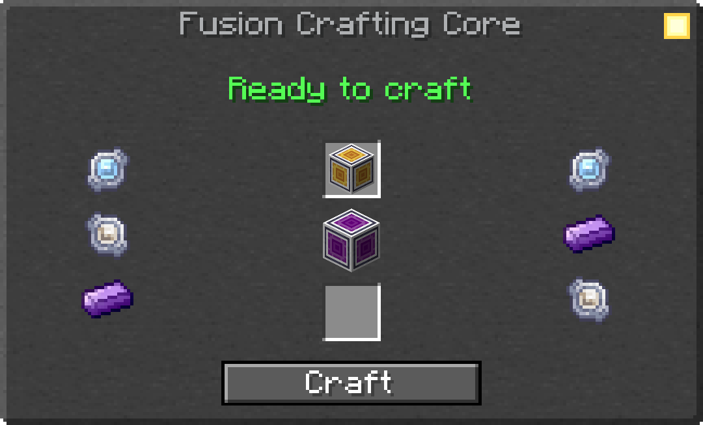
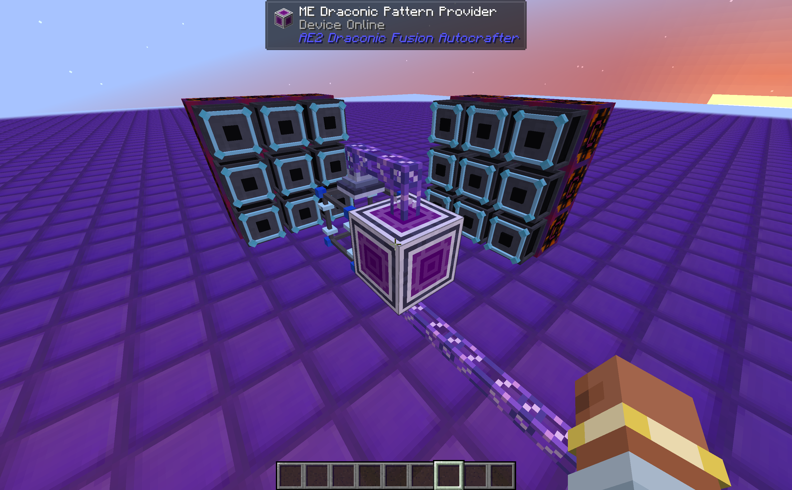

# ⚡ AE2 Draconic Fusion Autocrafter
**Seamlessly Automate Fusion Crafting with the Power of AE2!**

> 📝 **Changelog**: See [CHANGELOG.en.md](Docs/CHANGELOG.en.md) for version history.

---

## 📖 Overview

**AE2 Draconic Fusion Autocrafter** is a specialized addon designed to bridge the gap between **Applied Energistics 2** and **Draconic Evolution**. It introduces a native way to automate the complex Multi-Block Fusion Crafting process without the need for messy redstone, external timers, or complex subnetworks.

By providing custom Pattern Providers and intelligent routing logic, this mod ensures that catalysts and ingredients always find their correct place in your fusion structure, making top-tier Draconic crafting as simple as clicking "Craft" in your ME Terminal.

---

## ✨ Key Features

- 🧬 **Native AE2 Integration**: New blocks and parts that act like standard Pattern Providers but speak "Fusion".
- 🎯 **Intelligent Routing**: Automatically distinguishes between the Fusion Catalyst (Core) and Ingredients (Injectors).
- 🔄 **Recipe-Aware Logic**: Dynamically assigns items to injectors based on the active fusion recipe to prevent conflicts.
- ⚡ **Retry System**: Handles "Core Busy" states gracefully, preventing AE2 from timing out during long crafting operations.
- 🛠️ **No Shadowing**: Does not override Draconic Evolution's inventory logic, ensuring compatibility with all extraction methods (Import Bus, pipes, etc.).
- 📦 **Compact Design**: Use the Panel variant to keep your fusion setup sleek and hidden behind cables.

---

## 🎮 How It Works

### Setting Up the Automation

1. **Craft** an `ME Draconic Pattern Provider` (Block or Panel). 
2. **Place** it adjacent to a **Draconic Fusion Crafting Core**.
3. **Configure** your Fusion recipes in AE2 Patterns normally (Inputs on one side, Output on the other).
4. **Insert** the patterns into the Draconic Pattern Provider.
5. **Start Crafting!** The mod will automatically:
    - Send the catalyst to the Core.
    - Deterministically distribute ingredients to the valid injectors in range.
    - Wait for the Core to be free before pushing the next recipe.

---

## 📦 Installation

### Requirements
- **Minecraft**: 1.21.1
- **NeoForge**: 21.1.223 or higher
- **Applied Energistics 2**: 19.2.17 or higher
- **Draconic Evolution**: 3.1.4.632 or higher
- **Brandon's Core**: Required dependency for Draconic Evolution

---

## 🤝 Compatibility

### Tested With
- ✅ **Applied Energistics 2**: Deep integration
- ✅ **Draconic Evolution**: Full multi-block support
- ✅ **JEI/REI/EMI**: Integration for patterns

---

## 📄 License

This mod is licensed under the [MIT License](LICENSE). You are free to include it in any modpack!

## 👤 Author

**Franchino961** — [GitHub](https://github.com/Franchino961-Mod)

## 💬 Support

Report bugs or suggest features on our [Issue Tracker](../../issues). Please include your mod version and any relevant logs.

---

## 🔗 Links

- [Draconic Evolution](https://www.curseforge.com/minecraft/mc-mods/draconic-evolution)
- [Applied Energistics 2](https://www.curseforge.com/minecraft/mc-mods/applied-energistics-2)
- [NeoForge](https://neoforged.net/)

---

**Made with ❤️ for the AE2 & Draconic Evolution community!**
